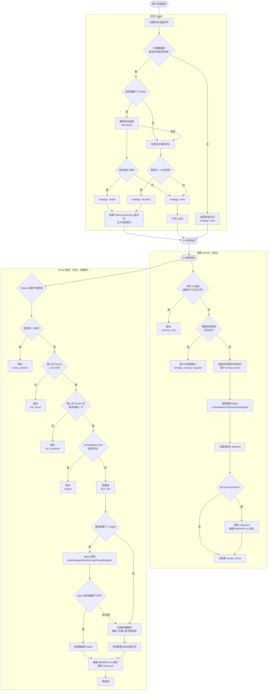
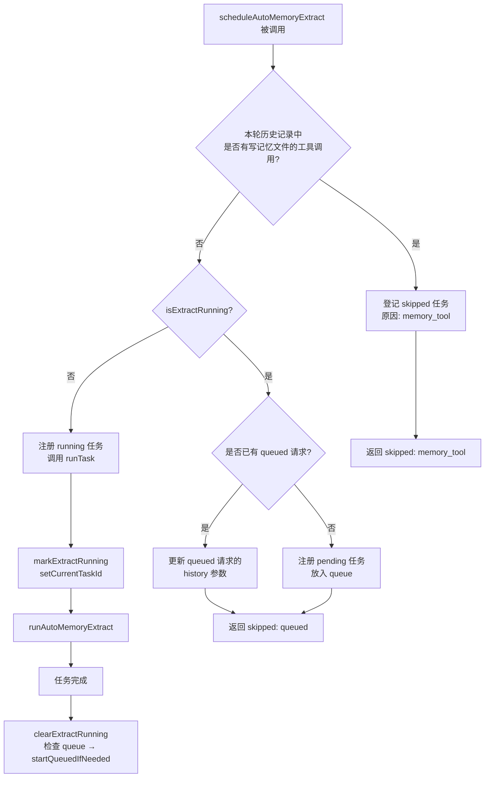
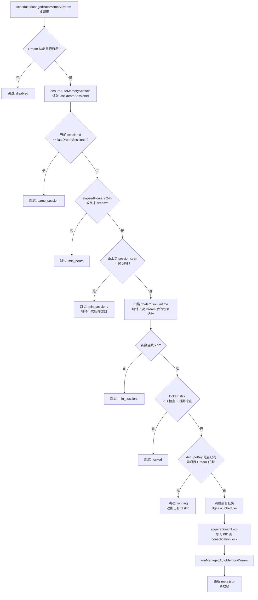
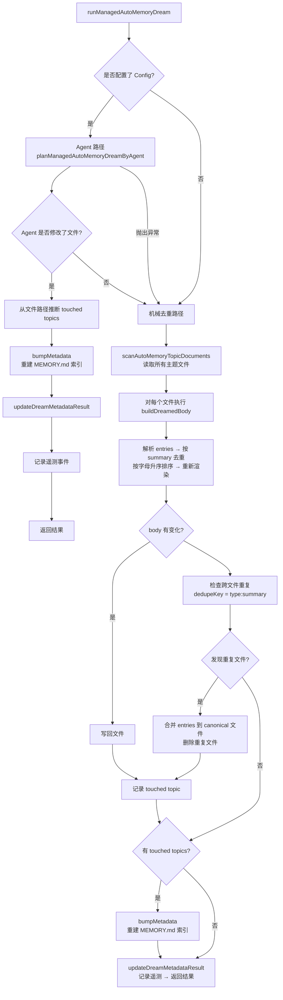
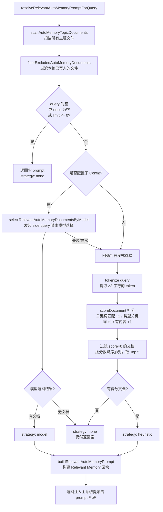
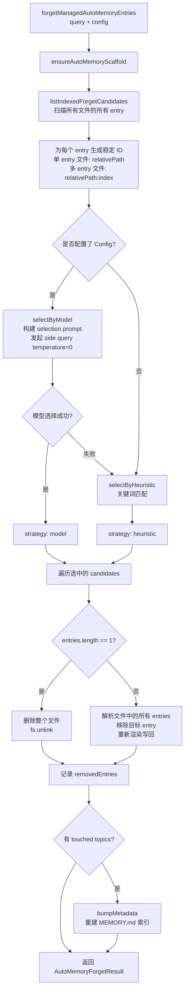

# 메모리 메모리 관리 시스템

> 이 글에서는 Qwen Code를 소개합니다.**관리형 자동 메모리**(호스팅 자동 메모리) 메모리 관리 메커니즘, 트리거 타이밍 및 구현 세부 정보입니다.

***

## 목차

1. [개요](#概述)
2. [저장 구조](#存储结构)
3. [메모리 유형](#记忆类型)
4. [메모리 입력 형식](#记忆条目格式)
5. [핵심 수명주기](#核心生命周期)
6. [추출 - 추출](#extract--提取)
7. [꿈 - 통합](#dream--整合)
8. [리콜 - 리콜](#recall--召回)
9. [잊다 - 잊어버리다](#forget--遗忘)
10. [인덱스 재구축](#索引重建)
11. [원격 측정 매장지점](#遥测埋点)

***

## 개요

Managed Auto-Memory는 AI 세션 중에 사용할 수 있는 도구 세트입니다.**오토매틱**사용자 관련 지식을 축적, 통합, 검색하는 영구 메모리 시스템입니다. 이는 다음과 같은 네 가지 핵심 작업을 통해 메모리의 수명 주기를 유지합니다.

| 작동하다 | 영문   | 트리거 모드              | 효과                                    |
| ---- | ---- | ------------------- | ------------------------------------- |
| 발췌   | 발췌   | 자동으로 (각 대화 라운드 이후)  | 대화 기록에서 새로운 지식을 추출하여 메모리 파일에 기록       |
| 통합   | 꿈    | 자동(주기적인 백그라운드 작업)   | 메모리 파일을 중복 제거하고 병합하여 깔끔하게 유지          |
| 상기하다 | 상기하다 | 자동으로(각 대화 라운드 전)    | 현재 요청과 관련된 메모리를 검색하여 시스템 프롬프트에 삽입합니다. |
| 잊다   | 잊다   | 수동(사용자 명령`/forget`) | 지정된 메모리 항목을 정확하게 삭제합니다.               |

***

## 저장 구조

### 디렉토리 레이아웃

```
~/.qwen/                                      ← 全局基础目录（默认）
└── projects/
    └── <sanitized-git-root>/                 ← 项目标识（基于 Git 根路径）
        ├── meta.json                         ← 元数据（提取/整合时间戳、状态）
        ├── extract-cursor.json               ← 提取游标（已处理的对话偏移量）
        ├── consolidation.lock                ← Dream 进程互斥锁
        └── memory/                           ← 记忆主目录
            ├── MEMORY.md                     ← 索引文件（自动生成，汇总所有条目）
            ├── user.md                       ← 用户偏好记忆（示例）
            ├── feedback.md                   ← 反馈规范记忆（示例）
            ├── project/
            │   └── milestone.md              ← 项目记忆（支持子目录）
            └── reference/
                └── grafana.md                ← 外部资源记忆
```

> **환경 변수 재정의**：
>
> * `QWEN_CODE_MEMORY_BASE_DIR`: 전역 기본 디렉터리 교체
> * `QWEN_CODE_MEMORY_LOCAL=1`: 대신 프로젝트 내의 경로를 사용하십시오.`.qwen/memory/`

### 주요 문서 설명

| 문서                    | 설명하다                                                      |
| --------------------- | --------------------------------------------------------- |
| `meta.json`           | 마지막 Extract/Dream 시간, 세션 ID, 관련된 메모리 유형, 실행 상태를 기록합니다.    |
| `extract-cursor.json` | 반복 추출을 피하기 위해 현재 세션이 처리된 대화 기록에 오프셋을 기록합니다.               |
| `consolidation.lock`  | Dream이 실행 중일 때 파일 잠금은 콘텐츠가 소유자의 PID이며 1시간 후에 자동으로 만료됩니다.  |
| `MEMORY.md`           | 모든 테마 파일의 색인, 각 Extract/Dream 후에 다시 작성됨, 형식은 Markdown 목록임 |

***

## 메모리 유형

시스템은 각기 다른 정보 차원에 해당하는 4가지 내장 메모리 유형을 지원합니다.

| 유형          | 콘텐츠 저장                                      | 언제 쓸까?                             | 언제 읽을까?                      |
| ----------- | ------------------------------------------- | ---------------------------------- | ---------------------------- |
| `user`      | 사용자의 역할, 기술 배경 및 작업 습관                      | 사용자 역할/선호도/지식 배경을 이해할 때            | 사용자의 배경에 따라 답변을 맞춤설정해야 하는 경우 |
| `feedback`  | AI 행동에 대한 사용자 지침: 피해야 할 것과 계속해야 할 것         | 이용자가 AI를 수정하거나, 명백하지 않은 행위를 확인한 경우 | AI의 행동 방식에 영향을 미칠 때          |
| `project`   | 프로젝트 진행 상황, 목표, 결정, 마감일, 버그 추적              | 누가 무엇을, 왜, 언제 수행하는지 이해             | AI가 업무 맥락과 동기를 이해하도록 도울 때    |
| `reference` | 외부 시스템 리소스 포인터(대시보드, 작업 주문 시스템, Slack 채널 등) | 외부 리소스와 그 사용법에 대해 배울 때             | 이용자가 외부 시스템이나 관련 정보를 언급하는 경우 |

**메모리에 저장하면 안되는 것**: 코드 패턴/규칙, Git 기록, 디버깅 시나리오, 임시 작업 상태, QWEN.md/AGENTS.md에 기록된 콘텐츠.

***

## 메모리 입력 형식

각 테마 파일은**YAML 머리말 + 마크다운 본문**체재:

```markdown
---
name: 记忆名称
description: 一句话描述（用于判断召回相关性，要具体）
type: user|feedback|project|reference
---

记忆主体内容（summary 行）

Why: 背后原因（让 AI 能理解边界情况而不是盲目遵守规则）
How to apply: 适用场景和使用方式
```

\~을 위한`feedback`그리고`project`입력하세요. 반드시 입력하는 것이 좋습니다.`Why`그리고`How to apply`, 경계 상황에서도 메모리가 여전히 올바르게 적용될 수 있도록 합니다.

***

## 핵심 수명주기



***

## 추출 - 추출

### 트리거 시간

AI가 한 라운드의 응답을 완료할 때마다`scheduleAutoMemoryExtract`자동으로 실행됩니다(백그라운드에서 차단되지 않음).

### 스케줄링 로직(`extractScheduler.ts`)



**건너뛰기 이유**：

| 이유                | 의미                                                     |
| ----------------- | ------------------------------------------------------ |
| `memory_tool`     | 이번 라운드의 주체는 충돌을 피하기 위해 메모리 파일을 건너뛰고 직접 메모리 파일을 작성했습니다. |
| `already_running` | 추출이 진행 중이므로 대기열에 추가할 수 없습니다.                           |
| `queued`          | 추출이 이미 실행 중이며 이 요청이 대기열에 추가되었습니다.                      |

### 코어 추출 과정(`extract.ts`)

```mermaid
flowchart TD
    A[runAutoMemoryExtract] --> B[ensureAutoMemoryScaffold\n初始化目录和文件]
    B --> C[buildTranscriptMessages\n将 Content[] 转换为带 offset 的消息列表]
    C --> D[readExtractCursor\n读取上次处理到的位置]
    D --> E[loadUnprocessedTranscriptSlice\n截取未处理的消息段]
    E --> F{slice 为空?}
    F -- 是 --> G[返回无 patches 结果]
    F -- 否 --> H[runAutoMemoryExtractionByAgent\n调用 forked agent 提取 patches]
    H --> I[dedupeExtractPatches\n去重+规范化]
    I --> J{有 touched topics?}
    J -- 是 --> K[bumpMetadata\n更新 meta.json]
    K --> L[rebuildManagedAutoMemoryIndex\n重建 MEMORY.md]
    L --> M[writeExtractCursor\n记录最新 offset]
    J -- 否 --> M
    M --> N[返回 AutoMemoryExtractResult]
```

**커서 추출(Cursor)**：

* 전지:`{ sessionId, processedOffset, updatedAt }`
* 각 추출 후 업데이트`processedOffset`현재의 역사적 길이입니다
* 다음에 추출할 때는 처리만 하세요.`offset >= processedOffset`소식
* 전체 세션(`sessionId`변경) 오프셋 0에서 다시 시작

**패치 필터 규칙**：

* 다이제스트 길이 < 12자 → 삭제
* 추상적인`?`종료 → 폐기 (질문)
* 임시 키워드 포함(오늘/지금/현재/임시 등) → 삭제
* 같은`topic:summary`결합 → 중복 제거

***

## 꿈 - 통합

### 트리거 시간

AI가 한 라운드의 응답을 완료할 때마다`scheduleManagedAutoMemoryDream`자동으로 실행됩니다(백그라운드에서 차단되지 않음). 그러나 이는 다중 게이팅 조건으로 보호되며 대부분의 경우 건너뜁니다.

### 스케줄링 게이팅(`dreamScheduler.ts`)



**게이팅 매개변수**：

| 매개변수                       | 기본값  | 설명하다                        |
| -------------------------- | ---- | --------------------------- |
| `minHoursBetweenDreams`    | 24시간 | 두 꿈 사이의 최소 시간 간격            |
| `minSessionsBetweenDreams` | 5회   | Dream을 실행하는 데 필요한 최소 새 세션 수 |
| `SESSION_SCAN_INTERVAL_MS` | 10분  | 세션 파일 검사를 위한 조절 간격          |
| `DREAM_LOCK_STALE_MS`      | 1시간  | 잠금 파일이 만료된 것으로 간주되는 시간 임계값  |

**잠금 장치**：

* 잠금 파일은 다음 위치에 있습니다.`<project-state-dir>/consolidation.lock`
* 내용은 보유 프로세스의 PID입니다.
* 확인 시: PID 프로세스가 더 이상 존재하지 않는 경우(`kill(pid, 0)`실패) 또는 잠금이 1시간을 초과한 경우 → 만료된 것으로 간주되어 자동으로 해제됩니다.

### 통합 실행 프로세스(`dream.ts`)



**기계적 중복 제거 논리**：

1. 각 테마 파일 내부: 누르기`summary.toLowerCase()`중복 제거, 병합`why`/`howToApply`필드
2. 요약을 알파벳순으로 재정렬
3. 파일 전체: 동일`type:summary`항목을 첫 번째 발견된 파일에 병합하고 중복 파일을 제거합니다.

***

## 리콜 - 리콜

### 트리거 시간

각 라운드마다 AI가 사용자 요청을 처리하기 전에`resolveRelevantAutoMemoryPromptForQuery`시스템 프롬프트 단어에 관련 메모리를 자동으로 트리거하고 주입합니다.

### 리콜 과정(`recall.ts`)



**채점 규칙(휴리스틱)**：

| 상태                        | 추가 포인트   |
| ------------------------- | -------- |
| 쿼리 토큰이 문서 콘텐츠에 나타납니다.     | +2 (토큰당) |
| 쿼리 토큰은 이 유형의 특징적인 키워드입니다. | +1(토큰당)  |
| 문서 본문이 비어 있지 않습니다.        | +1       |

**유형별 특징 키워드**：

* `user`：사용자, 선호도, 배경, 역할, 간결함
* `feedback`：피드백, 규칙, 회피, 스타일, 요약
* `project`：프로젝트, 목표, 사건, 마감일, 출시
* `reference`：참조, 대시보드, 티켓, 문서, 링크

**프롬프트 빌드 규칙**：

* 최대 5개의 문서 삽입(`MAX_RELEVANT_DOCS`)
* 각 문서 본문은 1,200자(`MAX_DOC_BODY_CHARS`)
* 잘림이 초과되면 프롬프트 추가: "참고: 프롬프트 예산 때문에 관련 메모리가 잘렸습니다."
* 문서 최신 정보 포함(파일 mtime 기준)

***

## 잊다 - 잊어버리다

### 트리거 시간

사용자가 수동으로 실행`/forget <query>`명령이 트리거됩니다.

### 망각과정(`forget.ts`)



**출입 ID 디자인**：

* 단일 항목 파일(일반적인 경우):`relativePath`(좋다`feedback/no-summary.md`)
* 다중 항목 파일:`relativePath:index`(좋다`feedback/style.md:2`)
* 안정적인 ID를 사용하면 모델이 동일한 파일의 다른 항목에 영향을 주지 않고 항목을 정확히 찾아낼 수 있습니다.

***

## 인덱스 재구축

`MEMORY.md`각 Extract 또는 Dream 이후에 호출되는 모든 테마 파일의 탐색 색인입니다.`rebuildManagedAutoMemoryIndex`재건:

```
- [用户偏好](user/preferences.md) — 用户是资深 Go 工程师，第一次接触 React
- [反馈规范](feedback/style.md) — 保持回复简洁，不要尾部总结
- [项目里程碑](project/milestone.md) — 移动端发布切分支前的合并冻结窗口
```

**지수 한도**：

* 한 줄에 최대 150자(한도 초과)`…`잘림)
* 최대 200줄
* 총 크기는 25,000바이트를 초과하지 않습니다.

***

## 원격 측정 매장지점

시스템에는 메모리 작업의 성능과 효과를 모니터링하기 위해 세 가지 유형의 원격 측정 이벤트가 내장되어 있습니다.

### 원격 측정 추출

| 필드               | 유형                        | 설명하다            |
| ---------------- | ------------------------- | --------------- |
| `trigger`        | `'auto'`                  | 트리거 모드(현재는 자동만) |
| `status`         | `'completed'`\|`'failed'` | 실행 결과           |
| `patches_count`  | 숫자                        | 추출된 유효한 패치 수    |
| `touched_topics` | 끈\[]                      | 기록할 메모리 유형 목록   |
| `duration_ms`    | 숫자                        | 총 소요 시간(밀리초)    |

### 꿈의 원격 측정

| 필드                | 유형                                | 설명하다                  |
| ----------------- | --------------------------------- | --------------------- |
| `trigger`         | `'auto'`                          | 트리거 모드                |
| `status`          | `'updated'`\|`'noop'`\|`'failed'` | 실행 결과                 |
| `deduped_entries` | 숫자                                | 기계적 경로 중복 제거를 위한 항목 수 |
| `touched_topics`  | 끈\[]                              | 수정된 메모리 유형 목록         |
| `duration_ms`     | 숫자                                | 총 소요 시간(밀리초)          |

### 원격 측정 리콜

| 필드              | 유형                                 | 설명하다         |
| --------------- | ---------------------------------- | ------------ |
| `query_length`  | 숫자                                 | 쿼리 문자열 길이    |
| `docs_scanned`  | 숫자                                 | 스캔된 총 문서 수   |
| `docs_selected` | 숫자                                 | 주입된 최종 문서 수  |
| `strategy`      | `'none'`\|`'heuristic'`\|`'model'` | 전략을 선택하세요    |
| `duration_ms`   | 숫자                                 | 총 소요 시간(밀리초) |

***

## 관련 소스 파일 인덱스

| 문서                                                   | 책임                                                                     |
| ---------------------------------------------------- | ---------------------------------------------------------------------- |
| `packages/core/src/memory/types.ts`                  | 유형 정의:`AutoMemoryType`、`AutoMemoryMetadata`、`AutoMemoryExtractCursor`  |
| `packages/core/src/memory/paths.ts`                  | 경로 계산:`getAutoMemoryRoot`、`isAutoMemPath`, 다양한 파일 경로 도우미               |
| `packages/core/src/memory/store.ts`                  | 비계 초기화:`ensureAutoMemoryScaffold`, 인덱스/메타데이터 읽기 및 쓰기                   |
| `packages/core/src/memory/scan.ts`                   | 테마 파일 스캔:`scanAutoMemoryTopicDocuments`, 머리말 구문 분석                     |
| `packages/core/src/memory/entries.ts`                | 항목 구문 분석 및 렌더링:`parseAutoMemoryEntries`、`renderAutoMemoryBody`         |
| `packages/core/src/memory/extract.ts`                | 핵심 로직 추출:`runAutoMemoryExtract`, 커서 관리, 패치 중복 제거                       |
| `packages/core/src/memory/extractScheduler.ts`       | 추출 스케줄러:`ManagedAutoMemoryExtractRuntime`, 큐/실행 상태 머신                  |
| `packages/core/src/memory/extractionAgentPlanner.ts` | 추출제:`runAutoMemoryExtractionByAgent`                                   |
| `packages/core/src/memory/dream.ts`                  | 핵심 로직 통합:`runManagedAutoMemoryDream`, 에이전트 경로 + 기계적 중복 제거              |
| `packages/core/src/memory/dreamScheduler.ts`         | 통합 스케줄러:`ManagedAutoMemoryDreamRuntime`, 출입문 제어 점검, 잠금 관리              |
| `packages/core/src/memory/dreamAgentPlanner.ts`      | 에이전트 통합:`planManagedAutoMemoryDreamByAgent`                            |
| `packages/core/src/memory/recall.ts`                 | 리콜 논리:`resolveRelevantAutoMemoryPromptForQuery`, 경험적 + 모델 이중 경로        |
| `packages/core/src/memory/forget.ts`                 | 논리는 잊어라:`forgetManagedAutoMemoryEntries`, 후보생성 + 정밀삭제                  |
| `packages/core/src/memory/indexer.ts`                | 인덱스 재구축:`rebuildManagedAutoMemoryIndex`,`buildManagedAutoMemoryIndex`  |
| `packages/core/src/memory/prompt.ts`                 | 시스템 프롬프트 템플릿: 메모리 유형 설명, 형식 예, 사용 사양                                   |
| `packages/core/src/memory/governance.ts`             | 거버넌스 제안 유형:`AutoMemoryGovernanceSuggestionType`                        |
| `packages/core/src/memory/state.ts`                  | 실행 상태 추출:`isExtractRunning`、`markExtractRunning`、`clearExtractRunning` |
| `packages/core/src/memory/memoryAge.ts`              | 신선도 설명:`memoryAge`、`memoryFreshnessText`                               |
