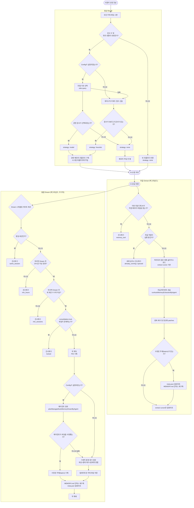
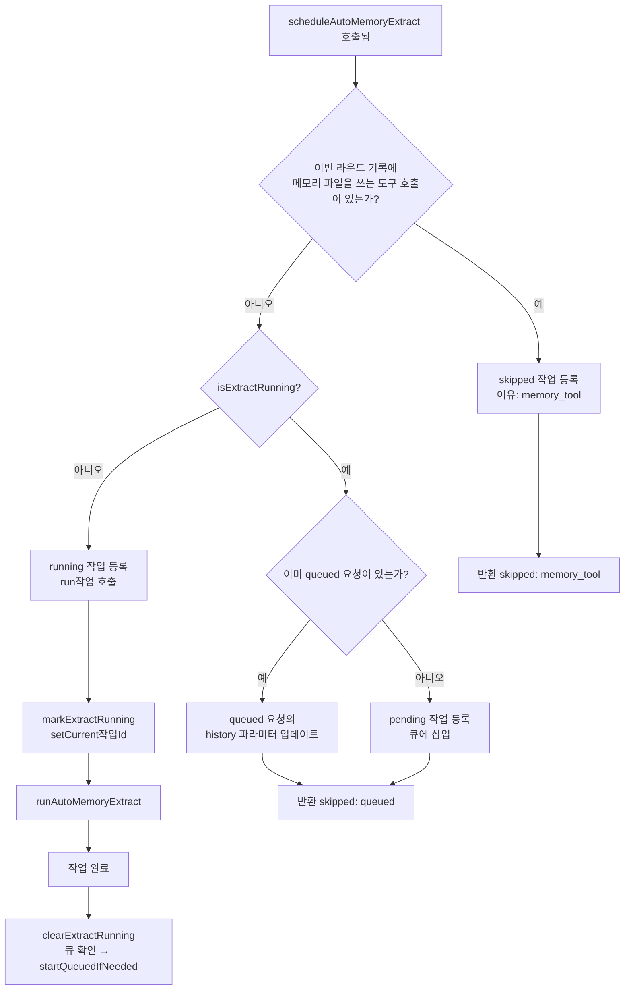
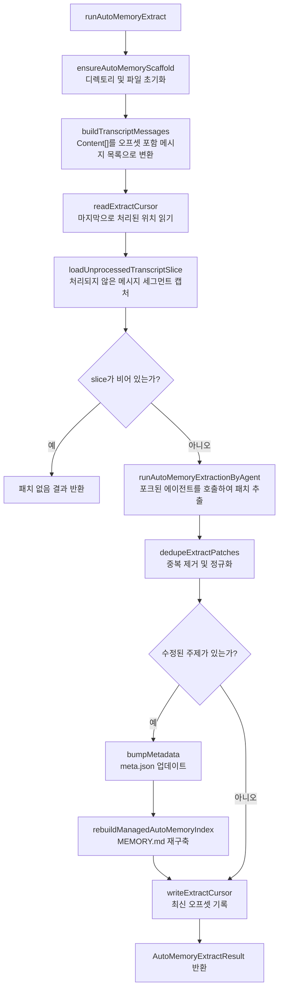
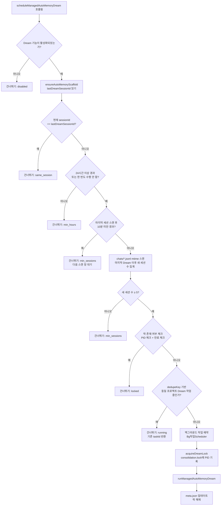
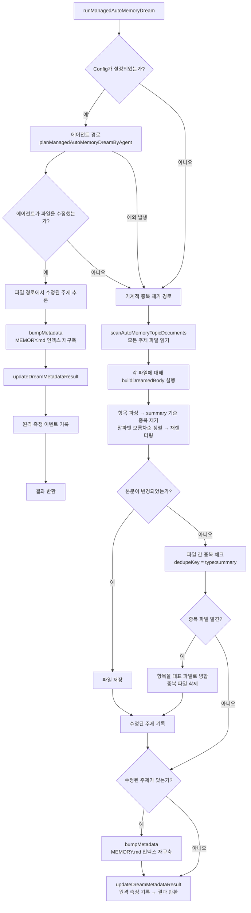
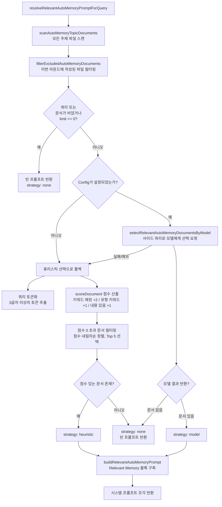
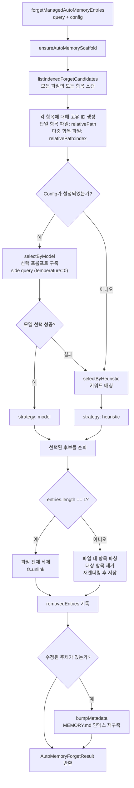

# 관리형 자동 메모리 (Managed Auto-Memory) 시스템

> 이 문서에서는 Qwen Code의 **관리형 자동 메모리** 메커니즘, 트리거 시점 및 구현 세부 사항을 소개합니다.

---

## 목차

1. [개요](#개요)
2. [저장 구조](#저장 구조)
3. [메모리 유형](#메모리 유형)
4. [메모리 항목 형식](#메모리 항목 형식)
5. [핵심 수명 주기](#핵심 수명 주기)
6. [추출 (Extract)](#추출-extract)
7. [통합 (Dream)](#통합-dream)
8. [리콜 (Recall)](#리콜-recall)
9. [삭제 (Forget)](#삭제-forget)
10. [인덱스 재구축](#인덱스-재구축)
11. [텔레메트리 (Telemetry) 지표](#원격-측정-telemetry-측정-지점)

---

## 개요

관리형 자동 메모리는 AI 세션 중에 사용할 수 있는 **자동** 영구 메모리 시스템으로, 사용자 관련 지식을 축적, 통합 및 검색합니다. 다음 네 가지 핵심 작업을 통해 메모리의 수명 주기를 유지합니다.

| 작업 | 영문명  | 트리거 방식                    | 효과                                                        |
| ---- | ------- | ------------------------------ | ----------------------------------------------------------- |
| 추출 | Extract | 자동 (매 대화 라운드 후)       | 대화 기록에서 새로운 지식을 추출하여 메모리 파일에 기록     |
| 통합 | Dream   | 자동 (주기적 백그라운드 작업)  | 메모리 파일을 중복 제거하고 병합하여 깔끔하게 유지          |
| 리콜 | Recall  | 자동 (매 대화 라운드 전)       | 현재 요청과 관련된 메모리를 검색하여 시스템 프롬프트에 삽입 |
| 삭제 | Forget  | 수동 (사용자 명령어 `/forget`) | 지정된 메모리 항목을 정확하게 삭제                          |

---

## 저장 구조

### 디렉토리 레이아웃

```
~/.qwen/                                      ← 전역 기본 디렉토리 (기본값)
└── projects/
    └── <sanitized-git-root>/                 ← 프로젝트 식별자 (Git 루트 경로 기반)
        ├── meta.json                         ← 메타데이터 (추출/통합 타임스탬프, 상태)
        ├── extract-cursor.json               ← 추출 커서 (이미 처리된 대화 오프셋)
        ├── consolidation.lock                ← Dream 프로세스 뮤텍스 락
        └── memory/                           ← 메모리 메인 디렉토리
            ├── MEMORY.md                     ← 인덱스 파일 (자동 생성, 모든 항목 요약)
            ├── user.md                       ← 사용자 선호도 메모리 (예시)
            ├── feedback.md                   ← 피드백 규정 메모리 (예시)
            ├── project/
            │   └── milestone.md              ← 프로젝트 메모리 (하위 디렉토리 지원)
            └── reference/
                └── grafana.md                ← 외부 리소스 메모리
```

> **환경 변수 재정의**:
>
> - `QWEN_CODE_MEMORY_BASE_DIR`: 전역 기본 디렉토리 교체
> - `QWEN_CODE_MEMORY_LOCAL=1`: 프로젝트 내의 `.qwen/memory/` 경로를 대신 사용

### 주요 파일 설명

| 파일                  | 설명                                                                        |
| --------------------- | --------------------------------------------------------------------------- |
| `meta.json`           | 마지막 추출/통합 시간, 세션 ID, 관련 메모리 유형, 실행 상태를 기록          |
| `extract-cursor.json` | 중복 추출을 방지하기 위해 현재 세션에서 처리된 대화 기록의 오프셋을 기록    |
| `consolidation.lock`  | Dream이 실행 중일 때의 파일 락. 내용은 소유자의 PID이며 1시간 후 자동 만료  |
| `MEMORY.md`           | 모든 주제 파일의 인덱스. 각 추출/통합 후 다시 작성되며 마크다운 목록 형식임 |

---

## 메모리 유형

시스템은 서로 다른 정보 차원에 대응하는 4가지 내장 메모리 유형을 지원합니다.

| 유형        | 내용 저장                                                        | 언제 쓰는가?                                         | 언제 읽는가?                                     |
| ----------- | ---------------------------------------------------------------- | ---------------------------------------------------- | ------------------------------------------------ |
| `user`      | 사용자의 역할, 기술 배경 및 작업 습관                            | 사용자 역할/선호도/지식 배경을 파악했을 때           | 사용자의 배경에 맞춰 답변을 최적화해야 할 때     |
| `feedback`  | AI 행동에 대한 사용자의 지침: 피해야 할 것과 계속해야 할 것      | 사용자가 AI를 교정하거나 명시적인 동작을 확인했을 때 | AI의 행동 방식에 영향을 주어야 할 때             |
| `project`   | 프로젝트 진행 상황, 목표, 결정 사항, 마감일, 버그 추적           | 누가, 무엇을, 왜, 언제 수행하는지 파악했을 때        | AI가 작업 맥락과 동기를 이해하도록 도울 때       |
| `reference` | 외부 시스템 리소스 포인터 (대시보드, 티켓 시스템, Slack 채널 등) | 외부 리소스와 그 사용법을 알게 되었을 때             | 사용자가 외부 시스템이나 관련 정보를 언급했을 때 |

**메모리에 저장하지 말아야 할 것**: 코드 패턴/규칙, Git 기록, 디버깅 시나리오, 임시 작업 상태, QWEN.md/AGENTS.md에 이미 기록된 내용.

---

## 메모리 항목 형식

각 주제 파일은 **YAML 프론트매터 + 마크다운 본문** 형식을 따릅니다.

```markdown
---
name: 메모리 명칭
description: 한 줄 설명 (리콜 관련성 판단에 사용됨, 구체적이어야 함)
type: user|feedback|project|reference
---

메모리 본문 내용 (요약 줄)

- 핵심 사항 1
- 핵심 사항 2
```

---

## 핵심 수명 주기



---

## 추출 (Extract)

### 트리거 시점

AI가 한 라운드의 응답을 완료할 때마다 `scheduleAutoMemoryExtract`가 자동으로 트리거됩니다 (백그라운드에서 실행되며 차단되지 않음).

### 스케줄링 로직 (`extractScheduler.ts`)



**건너뛰기 이유**:

| 이유              | 의미                                                                                |
| ----------------- | ----------------------------------------------------------------------------------- |
| `memory_tool`     | 이번 라운드에서 AI가 직접 메모리를 작성했으므로 충돌 방지를 위해 자동 추출을 건너뜀 |
| `already_running` | 추출이 이미 실행 중이며 대기열에 추가할 수 없음                                     |
| `queued`          | 추출이 이미 실행 중이며 이번 요청이 대기열에 추가됨                                 |

### 핵심 추출 프로세스 (`extract.ts`)



**추출 커서 (Cursor)**:

- 영속화: `{ sessionId, processedOffset, updatedAt }`
- 매 추출 후 `processedOffset`을 현재 대화 기록 길이로 업데이트
- 다음 추출 시 `offset >= processedOffset`인 메시지만 처리
- 세션 전체가 변경되면 (`sessionId` 변경) 오프셋 0부터 다시 시작

**패치 필터 규칙**:

- 요약 길이 < 12자 → 폐기
- `?`로 끝나는 추상적 질문 → 폐기
- 임시 키워드 포함 (오늘, 지금, 현재, 임시 등) → 폐기
- 동일한 `topic:summary` 조합 → 중복 제거

---

## 통합 (Dream)

### 트리거 시점

AI가 한 라운드의 응답을 완료할 때마다 `scheduleManagedAutoMemoryDream`이 자동으로 트리거됩니다. 하지만 여러 게이트 조건으로 보호되어 대부분의 경우 건너뜁니다.

### 스케줄링 게이트 (`dreamScheduler.ts`)



**게이트 파라미터**:

| 파라미터                   | 기본값 | 설명                                           |
| -------------------------- | ------ | ---------------------------------------------- |
| `minHoursBetweenDreams`    | 24시간 | 두 Dream 사이의 최소 시간 간격                 |
| `minSessionsBetweenDreams` | 5회    | Dream을 트리거하기 위해 필요한 최소 새 세션 수 |
| `SESSION_SCAN_INTERVAL_MS` | 10분   | 세션 파일 검사 주기 조절 간격                  |
| `DREAM_LOCK_STALE_MS`      | 1시간  | 락 파일이 만료된 것으로 간주되는 시간 임계값   |

**락 메커니즘**:

- 락 파일 위치: `<project-state-dir>/consolidation.lock`
- 파일 내용: 소유 프로세스의 PID
- 체크 시: PID 프로세스가 더 이상 존재하지 않거나 (`kill(pid, 0)` 실패) 락 생성 후 1시간 이상 경과 시 → 만료된 것으로 간주하여 자동 해제

### 통합 실행 프로세스 (`dream.ts`)



**기계적 중복 제거 로직**:

1. 각 주제 파일 내부: `summary.toLowerCase()` 기준 중복 제거, `why`/`howToApply` 필드 병합
2. 요약을 알파벳순으로 정렬
3. 파일 간: 동일한 `type:summary` 항목을 먼저 발견된 파일로 병합하고 중복 파일 삭제

---

## 회상 (Recall)

### 트리거 시점

매 라운드마다 AI가 사용자 요청을 처리하기 전에 `resolveRelevantAutoMemoryPromptForQuery`가 자동으로 트리거되어 시스템 프롬프트에 관련 메모리를 주입합니다.

### 회상 프로세스 (`recall.ts`)



**점수 산출 규칙 (휴리스틱)**:

| 조건                                    | 가산점    |
| --------------------------------------- | --------- |
| 쿼리 토큰이 문서 내용에 나타남          | 토큰당 +2 |
| 쿼리 토큰이 해당 유형의 특징적 키워드임 | 토큰당 +1 |
| 문서 본문이 비어 있지 않음              | +1        |

**유형별 특징 키워드**:

- `user`: user, preference, background, role, concise
- `feedback`: feedback, rule, avoid, style, summary
- `project`: project, goal, event, deadline, release
- `reference`: reference, dashboard, ticket, doc, link

**프롬프트 구축 규칙**:

- 최대 5개 문서 주입 (`MAX_RELEVANT_DOCS`)
- 각 문서 본문은 최대 1,200자 (`MAX_DOC_BODY_CHARS`)
- 초과 시 잘림 알림 추가: "Note: Relevant memory truncated due to prompt budget."
- 문서 최신성 정보 포함 (파일 mtime 기준)

---

## 삭제 (Forget)

### 트리거 시점

사용자가 수동으로 `/forget <query>` 명령어를 실행할 때 트리거됩니다.

### 삭제 프로세스 (`forget.ts`)



**항목 ID 설계**:

- 단일 항목 파일 (일반적인 경우): `relativePath` (예: `feedback/no-summary.md`)
- 다중 항목 파일: `relativePath:index` (예: `feedback/style.md:2`)
- 안정적인 ID를 사용함으로써 모델이 동일 파일 내의 다른 항목을 건드리지 않고 대상만 정확히 지울 수 있게 함

---

## 인덱스 재구축

`MEMORY.md` 파일은 모든 주제 파일의 개요를 제공하며, 각 추출, 통합 또는 삭제 작업 후에 다시 작성됩니다.

| 필드          | 설명                            |
| ------------- | ------------------------------- |
| `Name`        | YAML 프론트매터의 `name`        |
| `Type`        | YAML 프론트매터의 `type`        |
| `Description` | YAML 프론트매터의 `description` |
| `Updated`     | 파일의 마지막 수정 시간         |

---

## 원격 측정 (Telemetry) 측정 지점

메모리 작업의 성능과 효과를 모니터링하기 위해 3가지 유형의 원격 측정 이벤트가 내장되어 있습니다.

### 추출 원격 측정

| 필드         | 유형                                | 설명                           |
| ------------ | ----------------------------------- | ------------------------------ |
| `trigger`    | `'auto'`                            | 트리거 방식 (현재 자동만 지원) |
| `outcome`    | `'success'\|'no_patches'\|'failed'` | 추출 결과                      |
| `numPatches` | `number`                            | 생성된 메모리 패치 수          |
| `numTopics`  | `number`                            | 영향을 받은 주제 수            |
| `latencyMs`  | `number`                            | 추출 에이전트 실행 시간        |

### 통합 원격 측정

| 필드               | 유형                                | 설명                        |
| ------------------ | ----------------------------------- | --------------------------- |
| `trigger`          | `'auto'`                            | 트리거 방식                 |
| `outcome`          | `'success'\|'no_changes'\|'failed'` | 통합 결과                   |
| `numTopicsDeleted` | `number`                            | 삭제된(병합된) 주제 파일 수 |
| `numTopicsMerged`  | `number`                            | 수정된 주제 파일 수         |

### 리콜 원격 측정

| 필드              | 유형                           | 설명                    |
| ----------------- | ------------------------------ | ----------------------- |
| `strategy`        | `'none'\|'heuristic'\|'model'` | 선택 전략               |
| `numDocsScanned`  | `number`                       | 스캔된 총 문서 수       |
| `numDocsSelected` | `number`                       | 최종 선택된 문서 수     |
| `latencyMs`       | `number`                       | 리콜 결정에 소요된 시간 |

---

## 참고 파일

- 내장 명령: `/forget`
- 핵심 추출: `packages/core/src/memory/extract.ts`
- 핵심 통합: `packages/core/src/memory/dream.ts`
- 회상 로직: `packages/core/src/memory/recall.ts`, 시맨틱 + 키워드 매칭
- 설정 스키마: `packages/core/src/settings/schema.ts`
